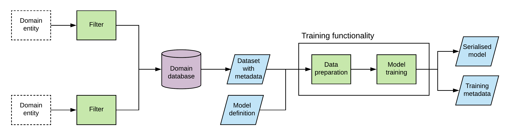
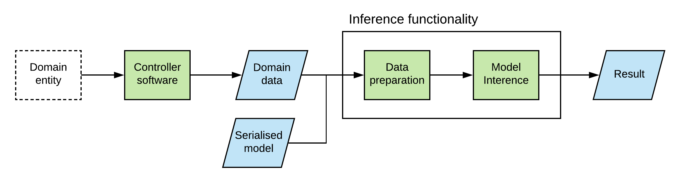

# Engineering Machine Learning Systems

## What are Machine Learning Systems?

A machine learning (ML) system is one in which part or all of the core functionality is driven by ML techniques. A key aspect of the ML field is the existence of algorithms that 'train' on an input dataset, returning a complicated structure that encodes some 'knowledge' of the data they've received. These trained models, when presented with data in same structure, ideally provide some useful insight, or inference, on that data based on patterns observed during training. ML models are typically resistant to inspection and are sensitive to the data on which they are trained, but are currently the most effective solution for a class of problems that has historically proven difficult. Harnessing their power whilst also guarding against the risks that arise from the nature of ML techniques is the fundamental conflict of ML system design. This post is the first in a series that describes how such risks can be mitigated or eliminated using specific design solutions. This post outlines the complexity inherent to ML systems and describes the general structure and operation of a system that consists of the design solutions presented in the subsequent posts.

## What is a Model?

For the purposes of clarity it is sensible to discuss what the term _model_ encompasses. This is a broad term that means different things in different fields and contexts. In machine learning, a model is the structure returned by a function that encodes some information about a dataset provided to that function (training), paired with a second function that utilises that structure to derive information about singular elements of data (inference). The pair of functions collectively defines the ML technique. In the software engineering context, _model_ typically refers to the collection of data that describes the structure of the model and the information it contains, as well as, often implicitly, the functionality that enables inference to be performed using that structure.

_Model training_ in the software engineering sense is the execution of the functionality that creates such models. In contrast to the academic context, in which models can be discussed in the abstract, models in the software engineering context are trained to address specific problems. They operate in a problem domain and thus inherit all of the complexities of that domain in addition to the complexity of the ML technique that they implement. Many design solutions specific to ML techniques and problem domains exist, but the interaction between ML techniques and problem domains presents a new set of risks and the need for design solutions to mitigate or eliminate them.

## Risks in ML System Engineering

Model training usually involves the application of a sequence of complicated algorithms to a large collection of data. Data is obtained from a datastore, manipulated into more useful forms, then provided to the model training algorithm in which it is further manipulated to extract useful information. Assessing the behaviour of models - identifying what information they extract from data and the accuracy of that information - produced using most ML techniques is extremely difficult for a number of reasons: the exact reasons as to why many ML techniques are effective are poorly understood; models are difficult to inspect because they typically have a complicated structure in which a large volume of data is embedded; and the data they contain is usually encoded in an abstract manner. When unusual or erroneous inference results are produced, there are no comprehensive techniques for identifying the specific factor of model training that caused this result. The models produced using most ML techniques are black boxes.

Although this is unfortunate, there remain two strategies to gain insight into the cause of unusual inference results:

1. Train models using similar training configurations to gain insight into what information the ML technique is extracting from the problem domain. Understanding the strengths and weaknesses of the ML technique on the domain can suggest why models trained using the technique are arriving at particular solutions.
2. Scrutinise the functionality of the ML system that produced the inference result to identify any flaws or defects that may have contributed to erroneous model training or inference. The ability to isolate the cause of defects depends on the existence of consistent functionality organised in such a way to make reasoning about its behaviour and interaction with other functionality possible.

Although both strategies can be powerful in their own right, the complexity of model training makes identifying exactly where this process deviated from the expected outcome problematic for a number of reasons:

* **Data preparation is an exacting task:** Small changes in how data is filtered, transformed and aggregated can have profound effects on model training, producing biases that are difficult to anticipate and identify. Data preparation may involve many steps and a high level of control is necessary to ensure that those steps are performed as expected.
* **Model training can be difficult to manage:** In addition to the complexities of data processing, the composition of the dataset used for training also influences the resultant model. Tracking which datasets were used to create which model is difficult yet essential to understand model performance, the model's ability to extract the intended information from data.
* **Training configurations may be complicated:** The behaviour of a model is a product of the decisions made in the creation of the training dataset, the steps involved in preprocessing the data, and the arguments supplied to the training algorithm. Effective control over model training depends on the ability to configure and control these variables.

In this series of posts, specific risks to data preparation, model training, and training configuration are discussed and design solutions to mitigate those risks are suggested. Although many of the presented solutions can be used in isolation to address specific risks, they are most effective when used together as they collectively enable an ML system to exhibit specific properties. In the following section, the high-level structure of such a system is presented.

## A Reference ML System

The conceptual system consists of functionality that enables two modes of operation: model training and model inference. The components that make up the system in its training mode are illustrated in Fig. 1. Domain data enters the system through filters, which validate the data before storing it within the system's datastore. The datastore is accessed by functionality responsible for constructing the dataset to be used in model training. This richly represented domain data is then processed by the system's data preparation functionality, which emphasises features of the data and encodes them in a form the model can process. The model training functionality receives this data and produces a trained model. The system consists of three concerns: the datastore serves as a single source of truth for domain data within the system; the data preparation functionality defines the application context for the model; and the training functionality constructs a model and collects essential metadata during the training process.

_Fig. 1. Illustration of the reference ML system in the training mode of operation. Data enters the system via filters that validate data before it enters the database. Datasets obtained from the database are used for training models according to the details in model definitions. The data is processed prior to training, and the result is the serialised model paired with information collected during the training process._

Note the inputs and outputs of the system in Fig. 1. Aside from the domain data and serialised model, these artefacts assist data and model traceability, enabling the origin of data to be tracked as it passes through the system and the origin of models to be traced once models enter use in production. The input and output artefacts are as follows:

- **Domain Data:** This is the primary data that the ML system processes and is the data from which we want to gain insight using ML techniques. This information is obtained from the real-world environment in which the system operates.
- **Metadata (domain data):** This is data _about_ the domain data that enters the ML system. A small set of metadata enables the tracing of data from when it enters the system through to the completion of training, as well as the generalisation of functionality oriented around domain data (e.g. the construction of datasets).
- **Model Definition:** This artefact is a specification of all aspects of model training: how training datasets are constructed, how data preprocessing is performed, and how the training algorithm is parameterised. Model definitions uniquely identify models and specify exactly how the model they define is created.
- **Metadata (model training):** Information collected during model training is captured in this artefact. This includes information about the data involved in training and the state of the software that performed the training. In some cases it can also include details about the performance of the trained model.
- **Serialised Model:** This artefact encodes the structure of a trained model and the information embedded within it, enabling functionality within the system to load the model and use it to perform inference.

In the broadest sense, the reference ML system in training mode can be envisioned as a function, taking a model definition and a collection of domain data paired with its metadata as input and returning a serialised model and training metadata as output. If this process can be made reproducible and side-effects are avoided, the difficulty of identifying and eliminating defects in the training process are much reduced.

The conceptual operation of the reference ML system in the inference mode of operation is relatively straightforward, as Fig. 2 illustrates. Trained models are loaded into the system so that inference can be performed. Data obtained from the domain is transformed into a form that the inference functionality can process, much like domain data is transformed for processing by the training functionality in the training mode of operation. In inference mode, domain data enters the system through controller software which determines how actors in the domain are able to obtain inference results - for example, the system in inference mode may take the form of a service - rather than via the datastore. Inference is generally a less complex task than training, and in many cases the core functionality required for inference is a subset of the functionality present for training. For this reason, the following posts in this series focus on training tasks.

_Fig. 2. Illustration of the reference ML system in inference mode of operation. Domain data enters the system via software that manages interfacing between domain entities and the system. Domain data is prepared for processing by inference functionality that utilises a serialised model to produce an inference result._

## Guide to this Series

The following posts focus on the topics of data storage, data preparation and model training, respectively:

* In [Part II](../post1/content.md), strategies for storing domain data within the system are described. Metadata is introduced as a mechanism to identify elements of domain data and to localise sources of data integrity loss. Other data integrity risks are also discussed.
* In [Part III](../post2/content.md), an approach to organising functionality to simplify the task of data tracing when data is manipulated into different form is outlined. The impact of rich data representations and testable functionality on the emergence of unintentional data dependencies and software defects is also examined.
* In [Part IV](../post3/content.md), the ability of various metadata to assist in data and model traceability during and after model training is described. Opportunities to identify training issues before models enter use in production are identified, and details that may impact the integrity of models are discussed.

Note that the scope of this series does not include representing specific problem domains, selecting data preparation techniques, and implementing training and inference algorithms. Concrete system details such as implementation languages and deployment strategies are also omitted. The design solutions presented in the following posts can be implemented in any technical context. Use them to guide the design of sound ML systems.

## Intelligence with Intention

The unifying theme of the design strategies presented in this series of posts is control: control over how data is represented and transformed, control over how the system constructs the desired models, and control over how data and models are traced and related to one another. Small efforts to increase control over complex systems repay themselves many times over because they increase confidence that the system is behaving as intended and issues, when they do occur, can be more easily isolated and corrected. Every design strategy presented in this series of posts mitigates a risk inherent in ML systems or introduces a mechanism for identifying the cause when any such risk is realised. Together, these strategies enable the creation of sound ML systems that are insulated from risks to data and process integrity.

